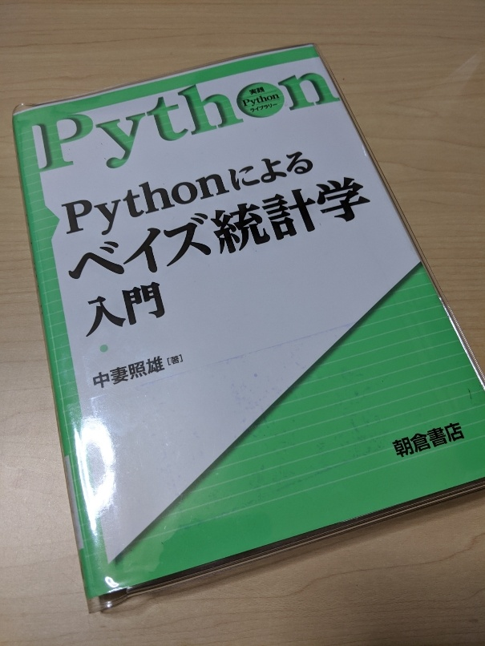

# 「Python によるベイズ統計学入門」の写経

「Python によるベイズ統計学入門」の python コードを写経し、google colab で動作確認をおこなっていく。

## 対象書籍の情報

|タイトル|Python によるベイズ統計学入門|
|:-:|:-:|
|著者|中妻 照雄|
|出版|朝倉書店|
|ISBN|9784254128987|

## 写経コード一覧

[Python コード 2.1 pybayes_beta_prior.py](2_1_pybayes_beta_prior.ipynb)

[Python コード 2.2 pybayes_beta_distribution.py](2_2_pybayes_beta_distribution.ipynb)

[Python コード 2.3 pybayes_conjugate_bernoulli.py](2_3_pybayes_conjugate_bernoulli.ipynb)
